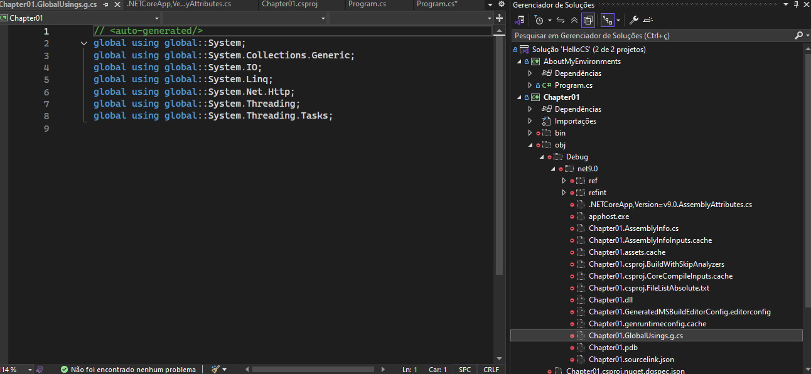

# C# 13 and .NET 9 Learning RepositoryU

This repository was created as part of my journey to learn **C# 13** and **.NET 9**, using the book [*C# 13 and .NET 9 – Modern Cross-Platform Development Fundamentals*](https://www.amazon.com/13-NET-Cross-Platform-Development-Fundamentals/dp/183588122X) as the primary guide

## Learning Goals:
* Complete the book by the end of 2025
* Dedicate at least two ours per day to:
	* Reading
	* Researching related topics
	* Implementing code examples
	* Applying the knoledge through experimentation

## Repository purpose
This is a learning-focused repositoryr, so:
* No formal project structure is enforced
* No stric architectural patterns or best practices are guaranteED (since I'll be learning another programing language, I'll be focusing on the basics)
* The goal is experimentation, understanding, and prectice, not production-level code

## Notes!
Bellow I'll save alooooot of notes of the book, code, implementations, and anything related during this learning journey!!

- We can compile C#, F# and VB to Common Intermediate Language (CIL) then Common Languagem Runtime and after machine code. Since
these three are compiled to the same CIL, e can build .NET projects with anyone of them

.NET environment:
* .NET Framework:
	*	Legacy, monolithic and Windows-only: Was created to work exclusively on windows environment, and in it we had tecnologies like
		*ASP.NET MVC* (earlier versions like ASP.NET MVC 5),, which, although robust, were tight coupled with windows ecosystem
* .NET Core
	*   Multi-platform and with better performance: It arose to meet  the need for a modern, cross-platform, and modular environment. .NET Core brought significant performance improvements and allowed applications to run on different operation systems like Linux and MacOS
* .NET 5+
	* Unification of .NET ecosystem: Starting with .NET 5, Microsoft dropped "Core" from the name to signal that the modern platform unified the experiences of .NET Core and other implementations
    * Inclusion of ASP.NET Core (and ASP.NET Core MVC): In this unified environment, ASP.NET Core is already integrated with the MVC pattern (alongside other approaches like Razor Pages and APIs). This means that when developing a modern web application with .NET 5 or later, you're already using the most up-to-date and optimized version of MVC — namely, ASP.NET Core MVC — without needing to install a separate component.

## Using command line to creater a project and solution

We just need to be sure of the folder we'll be creating it in, so, we'll be creating a new console app:

I'll browse where I already have a solution (HelloCS) where Chapter01 is located and:
```shell 
dotnet new console -o <NAME_OF_THE_PROJECT> --use-program-main 
```

After creating it, we'll create the solution
```shell 
dotnet sln add <NAME_OF_THE_SOLUTION>
```

If everything is defined correctly as well as the paths and folders, the solution will be availiable in the solution explorer (only after we sln add)


## Understand "Go to Definition"
In the page 41 it is taught about "Go to definition" feature, I'm using Visual studio Code
It was shown that, for example, defining a variable:
```csharp
int variable;
```

We click on 'int' and go to definition, we arive in struct Int32

```csharp
#region assembly System.Runtime, Version=9.0.0.0, Culture=neutral, PublicKeyToken=b03f5f7f11d50a3a
// C:\Program Files\dotnet\packs\Microsoft.NETCore.App.Ref\9.0.5\ref\net9.0\System.Runtime.dll
#endregion

#nullable enable

using System.Diagnostics.CodeAnalysis;
using System.Globalization;
using System.Numerics;
using System.Runtime.CompilerServices;

namespace System
{
    //
    // Resumo:
    //     Represents a 32-bit signed integer.
    public readonly struct Int32 ....
```

And chosing one of its methods we're giving:
* A summary that describes the method
* Parameters that it accepts 
* Return of the method as well as its type
* And all the exceptions that could be thrown by it


It was also taugth in page 42 how to enable **Inline hints** as well as where to find help, where to look in the documentation, repositories AND how to disable Copilot (Since I'm learning. I'll also disable) 

## Some questions about .NET
Answering Exercise 1.3 – Test your knowledge
 Try to answer the following questions, remembering that although most answers can be found in this 
chapter, you should do some online research or code writing to answer others:
 1. Is Visual Studio better than VS Code?
 VS is more modular while Visual Studio is prefered for .NET development

 2. Are .NET 5 and later versions better than .NET Framework?
 Well, it is performatic, cross platform and cloud ready. So we could say that .NET5+ is better than .NET framework, altough it is an evolution.

 3. What is .NET Standard, and why is it still important?
 ???

 4. Why can a programmer use different languages (for example, C# and F#) to write applications 
that run on .NET?
C#, VB and F# will all be compiled to the same format called **Microsoft Intermediate Language**. Any language that is compatible with .NET will be converted to a code that can be executed by the **Common Language Runtime**

 5. What is a top-level program, and how do you access any command-line arguments?
Is a simplified way to write console applications without explicitly defining a main method or a Program class, the compiler will automatically generate the necessary entry point

 6. What is the name of the entry point method of a .NET console app, and how should it be ex
plicitly declared if you are not using the top-level program feature?
The name is Main:

```cs 
class Program
{
    static void Main(string[] args)
    {
        Console.WriteLine("Hello, .NET!");
    }
}
```
it is not needed to declare it explicitly, instead we write statements directly in the file, and the compiler automatically generates the entry point


 7. What namespace is the Program class defined in with a top-level program?
 None, altough it is implicity placed in the global namespace.


 8. Where would you look for help for a C# keyword?
 Go to Definition (F12)

 9. Where would you look first for solutions to common programming problems?
 Documentation, of course.

 10. What should you do after getting AI to write code for you
 We should allways check! It is good to help us learn, not to do our job


## Continuing with the basics
We have #region, with it, we can define parts of the code that can be collapsed:

```cs
#region 
Console.WriteLine("Value is {0}",1.0);

for  (z = 0; z < 10;z++)
{
    Console.WriteLine("Value of z ");
}
#endregion
``` 

## Nmespaces
Paraphrasing the book "System.Console.WriteLine tess the compiler to look for a method named WriteLine in a type named Console in a namespace named System

Thus, we need a type to be in a namespace, this way we'll be able to call them

This is called "Importing the namespace", still with the book example
When we:
```cs
using System;
```

All of **System** types will be availiable for us in the class that we imported it

We can also use:
```cs
global using System;
global using System.Linq; 
```

When using **global**, we we'll only need to import in one file for the import to be availiable in all files. But it's recommended to create a new file to hold all the global imports


Like the above image, it .GlobalUsings.g.cs file is generated automatically by the compiler.

We could also delete this file or use 
```xml 
<ImplicitUsings>disable</ImplicitUsings>
```

But it was recomended to keep the file and "enable and modify the project file to change whats is included in the auto-generated class file in the obj folder hierarchy"

I believe that in the section **Verbs and methods**, I'll just glaze the topic because I believe that I know pretty much how does it work (Unless I don't and I'll keep my notes down here)


---

### 1. Creating the Project

To create the **any** project inside an already existing solution in Visual Studio:

* Open the existing `Solution`.
* Right-click on the solution in the Solution Explorer and select **Add > New Project...**
* Choose **Console App** (.NET Core or .NET 9).
* Name the project **PROJECT_NAME**, choose the desired framework, and click **Create**.
* To set it as the startup project, right-click the solution again and go to **Set Startup Projects...**, then select **Current Selection** or choose **Numbers** manually.

---

### 2. Working with Characters and Strings in C\#

**Characters** use single quotes (`'`) and represent a single character:

```csharp
char letter = 'A';
char digit = '1';
char symbol = '$';
```

**Strings** use double quotes (`"`). They can store names, paths, or formatted content:

```csharp
string firstName = "Bob";
string filePath = @"C:\televisions\sony\bravia.txt"; // Use @ for file paths
```

C# 11+ supports **raw string literals** for multi-line formats like XML, JSON:

```csharp
string xml = """
    <person age="50">
        <first_name>Mark</first_name>
    </person>
    """;
```

**String interpolation** with embedded expressions:

```csharp
var person = new { FirstName = "Aline", Age = 56 };
string json = $$"""
    { 
        "first_name": "{{person.FirstName}}",
        "age": {{person.Age}},
        "calculation":"{{{1 + 2}}}"
    }
    """;
```

---

### 3. About the Numbers Project


---
Claro, Marcos! Aqui estão duas sessões documentadas em inglês para o seu repositório, mantendo o estilo didático e claro que você já vem usando:

---

## Objects and Default Values in C#

This section explores how objects and value types behave in C# when declared without initialization and when instantiated with `new`. It also demonstrates the shorthand syntax available since C# 9+.

### Key Concepts:
- **Value types** like `int`, `short`, `DateTime`, etc., are initialized with *default values*.
- **Reference types** like `Person` default to `null`.
- You can omit specifying the type in object instantiation when the type is already known in context (`new()` syntax).
- `default(type)` reveals what the compiler considers the zero-value for a given type.

### Example:

```csharp
short age;              // default = 0
long sizeOfCountry;     // default = 0
DateTime someDate;      // default = 01/01/0001
Point location;         // default = (0,0)
Person bob;             // default = null
```

Later, you can assign values using `new()` or shorthand initializers:

```csharp
age = 43;
sizeOfCountry = 50_000;
someDate = new(2000, 5, 10);
bob = new("Bob", "Surname", someDate.Year);
```

When using collection initializers:

```csharp
List<Person> people = new()
{
    new() { Name = "Alice" },
    new() { Name = "Bob" },
    new() { Name = "Charlie" }
};
```

And examining default values:

```csharp
Console.WriteLine($"default(int) = {default(int)}");             // 0
Console.WriteLine($"default(bool) = {default(bool)}");           // False
Console.WriteLine($"default(DateTime) = {default(DateTime)}");   // 01/01/0001
Console.WriteLine($"default(string) = {default(string) ?? "<NULL>"}");  // <NULL>
```

---

## Notes on Instantiation Syntax and Design Choices

This section clarifies why and how `new()` can simplify your code and improve readability, especially when you're working with collections or temporary objects.

### Best Practices:
- Use `new()` when the compiler already knows the target type — e.g., variable assignment or object initialization within a list.
- Still use explicit types (`new Type(...)`) when clarity is needed, especially in APIs or public method signatures.
- Favor object initializers to cleanly assign multiple properties at once.
 